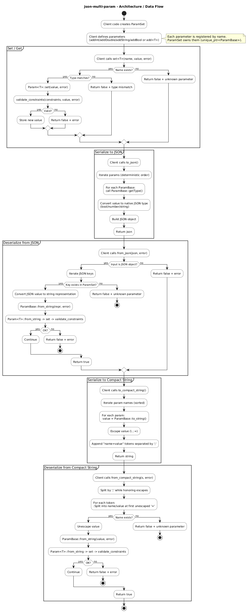
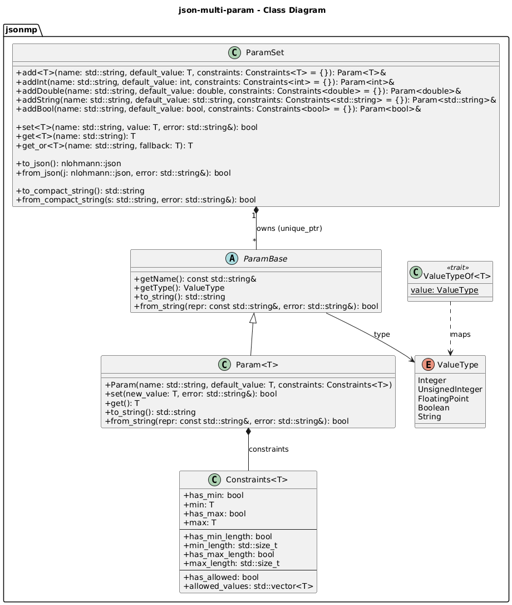

# JSON Multi-Param


---

## ✨ Core Features

- **Strongly-typed parameters**
  - Define configuration parameters with explicit C++ types (`int`, `double`, `bool`, `std::string`).
  - Type-safe access through templated `set<T>()` / `get<T>()` APIs.

- **Constraint-based validation**
  - Numeric constraints: minimum / maximum values.
  - String constraints: length limits and allowed value sets.
  - Validation enforced on every assignment and deserialization.

- **Deterministic serialization**
  - Stable, deterministic ordering of parameters for reproducible outputs.
  - Suitable for logging, testing, and communication protocols.

- **Multiple serialization formats**
  - **Typed JSON** serialization using `nlohmann::json`.
  - **Compact string format** (`key=value;key=value;...`) designed for embedded or bus-based systems.

- **Robust parsing**
  - Strict deserialization: unknown parameters and type mismatches are rejected.
  - Escape-safe compact format supporting special characters (`;`, `=`, `\`).

---
## 🌟 Project Highlights

- **Designed for embedded and modular systems**
  - Explicit parameter schemas shared across modules.
  - Strict parsing model to prevent silent configuration drift.

- **Clear separation of concerns**
  - Parameter definition, validation, and serialization are cleanly separated.
  - No dependency on application-specific logic.

- **Modern C++ design**
  - C++14-compliant, header-only traits and templated APIs.
  - RAII-friendly and exception-aware error handling.

- **Test-driven development**
  - Comprehensive unit tests covering validation, serialization, and edge cases.
  - Deterministic outputs validated through automated tests.

- **CI-ready**
  - Linux build and test pipeline using CMake, Ninja, and Docker.
  - Reproducible builds validated in continuous integration.


---

## 🏗 Data flow / Serialization flow



---

## 🗂 Class model



---

## 🛠 Build Instructions

### Windows (Visual Studio 2022)

1. Open Visual Studio 2022.

2. Choose “Open Folder” → select the project root (json-multi-param/).

3. Visual Studio automatically detects CMakePresets.json.

4. In the toolbar, select a configuration:

    - debug → includes unit tests (BUILD_TESTING=ON)

    - release → optimized build

5. Build the project (Ctrl + Shift + B).

6. The build produces:

    - A static library: json_multi_param

    - Example executables (e.g. device_config_example.exe)

    - Unit tests executable (tests.exe, debug only)

7. Executables are generated under:

```
build/<preset>/
```

They can be launched directly from Visual Studio or from the command line.

---

### Windows (PowerShell/CLI)
You can also build manually from a terminal with CMake presets:

```powershell
cmake --preset release    # Configure for Release
cmake --build --preset release -j  # Build using Ninja or MSBuild

cmake --preset debug      # Configure for Debug (with tests)
cmake --build --preset debug -j
ctest --preset debug      # Run unit tests
```
---

### Linux / WSL (Debian/Ubuntu based)
Install dependencies:
```bash
sudo apt update
sudo apt install -y build-essential cmake ninja-build git
```
Clone and build:
```bash
git clone https://github.com/sergioguerreroblanco-oss/json-multi-param.git
cd json-multi-param

cmake --preset release
cmake --build --preset release -j$(nproc)

# Debug build (includes unit tests)
cmake --preset debug
cmake --build --preset debug -j$(nproc)
ctest --preset debug
```
The resulting binary will be located in:
```
build/<preset>/
```

### Docker (fully reproducible environment)
The project includes a Dockerfile intended for CI / verification purposes.

It performs:
 - A clean Release build
 - Full unit test execution inside the container

```bash
docker build -t json-multi-param:local .
```

This image is meant for build and test validation, not as a runtime distribution.

---

## 🧪 Unit Tests

Unit tests are implemented using **GoogleTest** and fully integrated into the build system via **CTest**.

All tests are automatically enabled when building with:
```
BUILD_TESTING=ON
```
The test suite validates the **functional correctness**, **type safety**, and **deterministic behavior** of the library.

---

### ✅ Covered Scenarios

The following behaviors are fully covered by the current test suite:

| Test Name                                     | Validates                                                                 |
|----------------------------------------------|---------------------------------------------------------------------------|
| **AddSetGetIntAndString**                     | Basic parameter creation, typed set/get operations                        |
| **IntMinMax**                                | Integer min/max constraint enforcement                                    |
| **StringAllowedValues**                      | String allowed-values constraint enforcement                               |
| **JsonRoundTrip**                            | JSON serialization and deserialization round-trip                          |
| **JsonTypesAreTyped**                        | JSON values are emitted using proper JSON types (bool, number, string)    |
| **CompactStringIsDeterministic**              | Compact string output is deterministic and alphabetically ordered          |
| **CompactStringRoundTripWithEscapes**         | Robust handling of escaped `;`, `=` and `\` characters                     |
| **GetOrReturnsFallbackWhenMissing**           | Safe fallback access for missing parameters                                |
| **GetOrThrowsOnTypeMismatch**                 | Strong runtime protection against type mismatches                          |

---

### 🧩 Behavioral Guarantees Provided by Tests

The test suite guarantees that:

✔ Parameter definitions are **strongly typed and validated**  
✔ All constraint violations are **detected and reported**  
✔ JSON and compact-string formats are **round-trip safe**  
✔ Compact-string serialization is **stable and deterministic**  
✔ Invalid input never silently corrupts internal state  
✔ Type mismatches are detected **early and explicitly**

These guarantees make the library suitable for use in
**configuration handling**, **embedded systems**, and **communication protocols**
where correctness and predictability are critical.

### Running Tests (Windows)

On Windows, the project has been validated with **Visual Studio 2022**.

Tests can be executed directly from **Test Explorer**:

`Menu → Test → Run All Tests`

Alternatively, using CMake presets:

```powershell
cmake --preset debug
cmake --build --preset debug
ctest --preset debug --output-on-failure
```
> Note - Need to have installed: 
> 1. [CMake](https://github.com/Kitware/CMake/releases/download/v4.1.1/cmake-4.1.1-windows-x86_64.msi)
> 2. Ninja: 
>```bash 
> winget install Ninja-build.Ninja
>```

### Running Tests (Linux / Docker)

After building the project:

```bash
cd build/debug
ctest --output-on-failure
```

CTest automatically discovers and executes all GoogleTest cases.

### Example output:
```
Test project C:/PROJECTS/json-multi-param/build/debug
    Start 1: ParamSetBasicFixture.AddSetGetIntAndString
1/9 Test #1: ParamSetBasicFixture.AddSetGetIntAndString ...............   Passed    0.01 sec
    Start 2: ParamSetBasicFixture.IntMinMax
2/9 Test #2: ParamSetBasicFixture.IntMinMax ...........................   Passed    0.01 sec
    Start 3: ParamSetBasicFixture.StringAllowedValues
3/9 Test #3: ParamSetBasicFixture.StringAllowedValues .................   Passed    0.01 sec
    Start 4: ParamSetBasicFixture.JsonRoundTrip
4/9 Test #4: ParamSetBasicFixture.JsonRoundTrip .......................   Passed    0.01 sec
    Start 5: ParamSetBasicFixture.JsonTypesAreTyped
5/9 Test #5: ParamSetBasicFixture.JsonTypesAreTyped ...................   Passed    0.01 sec
    Start 6: ParamSetBasicFixture.CompactStringIsDeterministic
6/9 Test #6: ParamSetBasicFixture.CompactStringIsDeterministic ........   Passed    0.01 sec
    Start 7: ParamSetBasicFixture.CompactStringRoundTripWithEscapes
7/9 Test #7: ParamSetBasicFixture.CompactStringRoundTripWithEscapes ...   Passed    0.01 sec
    Start 8: ParamSetBasicFixture.GetOrReturnsFallbackWhenMissing
8/9 Test #8: ParamSetBasicFixture.GetOrReturnsFallbackWhenMissing .....   Passed    0.01 sec
    Start 9: ParamSetBasicFixture.GetOrThrowsOnTypeMismatch
9/9 Test #9: ParamSetBasicFixture.GetOrThrowsOnTypeMismatch ...........   Passed    0.01 sec
100% tests passed, 0 tests failed out of 9
Total Test time (real) =   0.09 sec
```

---

## 🐳 Docker

This project includes a **multi-stage Dockerfile** that provides a fully reproducible
build and test environment.

Docker is required and must be installed and running on your system.

Build image:

```
docker build -t json-multi-param:dev .
```

Run tests inside the container

All unit tests are executed automatically during the image build.
You can also run the container explicitly:

```
docker run --rm json-multi-param:dev
```

Run example binary

The runtime image executes the device_config_example binary by default:

```
docker run --rm json-multi-param:dev
```

By default, the container builds the project in /app/build/. The binary can be invoked as shown.

---

## 🔄 Continuous Integration

This project uses **GitHub Actions** to ensure build correctness and long-term stability.
All workflows are defined under `.github/workflows/`.

### `ci.yml`

The main CI workflow performs the following steps:

- Builds the project on **ubuntu-latest** using **CMake + Ninja**.
- Runs the full unit test suite via **CTest** with detailed failure output.
- Builds the Docker image and verifies it executes correctly inside a container.

✅ This ensures that:

- The codebase compiles cleanly on a fresh Linux environment.
- All unit tests pass consistently.
- The Docker image remains functional and reproducible.

### `docs.yml`

This workflow automates API documentation generation using **Doxygen**:

- Installs Doxygen, Graphviz, and a LaTeX toolchain.
- Generates **HTML** and **PDF** documentation from source code comments.
- Uploads generated artifacts for direct download from the workflow summary.
- Deploys HTML documentation to **GitHub Pages** when pushing to the `main` branch.

✅ This ensures that:

- Documentation is always in sync with the current source code.
- Both HTML and PDF outputs are generated automatically.
- Public documentation can be accessed directly via GitHub Pages.

---

## 📂 Project Structure

```
json-multi-param/
├── .github/
│   └── workflows/
│       ├── ci.yml              # Continuous Integration (build + tests + Docker)
│       └── docs.yml            # Documentation generation (Doxygen)
│
├── include/                    # Public library headers
│   ├── constraints.h
│   ├── logger.h
│   ├── param_base.h
│   ├── param.h
│   ├── param_set.h
│   └── value_type_traits.h
│
├── src/                        # Library implementation
│   ├── logger.cpp
│   ├── param_base.cpp
│   └── param_set.cpp
│
├── examples/                   # Usage examples
│   └── device_config/
│       ├── device_config_protocol.h
│       └── device_config_example.cpp
│
├── tests/                      # Unit tests (GoogleTest)
│   └── test_param_set_basic.cpp
│
├── docs/                       # Documentation sources and outputs
│   ├── architecture_diagram.puml       # UML architecture diagram (PlantUML)
│   ├── architecture_diagram.png
│   ├── class_diagram.puml              # UML class diagram (PlantUML)
│   ├── class_diagram.png
│   ├── Doxyfile
│   └── README.md
│
├── scripts/                    # Helper scripts
│   ├── build.ps1
│   ├── build.sh
│   ├── generate_docs.ps1
│   └── generate_docs.sh
│
├── external/                   # Third-party dependencies (vendored)
│   └── nlohmann/
│       └── json.hpp
│
├── .clang-format               # Code style configuration
├── .dockerignore
├── .gitattributes
├── .gitignore
├── CMakeLists.txt
├── CMakePresets.json
├── Dockerfile
└── README.md
```

---

## 📖 Documentation

This project uses **[Doxygen](https://www.doxygen.nl/)** to generate API documentation directly
from source code comments.

Documentation is generated using a single, centralized Doxygen configuration
and can be built locally or via CI.

### Generate documentation

#### Windows (PowerShell)
```powershell
Set-ExecutionPolicy -Scope Process -ExecutionPolicy Bypass
.\scripts\generate_docs.ps1
```
Generates HTML (docs/html/index.html) and LaTeX sources (docs/latex/).

> ⚠ PDF (refman.pdf) is not generated on Windows unless you install a full LaTeX toolchain (MiKTeX/TeX Live + make).

#### Linux / WSL (Debian/Ubuntu based)
```bash
sudo apt update
sudo apt install -y doxygen graphviz texlive-latex-base texlive-fonts-recommended texlive-latex-extra make
chmod +x scripts/generate_docs.sh
./scripts/generate_docs.sh
```
Generates HTML (docs/html/index.html) and PDF (docs/latex/refman.pdf).

Open in your browser:
```bash
docs/html/index.html
```

For more details, see docs/README.md

---

## 🎨 Code Style (clang-format)

This project uses **clang-format** to enforce a consistent and readable C++ code style.
All formatting rules are defined in [`.clang-format`](./.clang-format).

### 🔧 Chosen Style

The configuration is based on the **Google C++ Style**, with selected adjustments to
improve readability and maintainability in modern C++ projects:

| Setting                                 | Value               | Description |
| --------------------------------------- | ------------------- | ----------- |
| **BasedOnStyle**                        | `Google`            | Provides a solid and widely adopted baseline. |
| **Language**                            | `Cpp`               | Ensures C++-specific formatting rules. |
| **IndentWidth / TabWidth**              | `4`                 | Uses 4 spaces per indent for improved block readability. |
| **UseTab**                              | `Never`             | Enforces spaces only, ensuring editor consistency. |
| **ColumnLimit**                         | `100`               | Balances readability with long expressions and templates. |
| **BreakBeforeBraces**                   | `Allman`            | Places braces on their own line, improving visual structure. |
| **AllowShortIfStatementsOnASingleLine** | `false`             | Forces explicit line breaks for clarity. |
| **AllowShortLoopsOnASingleLine**        | `false`             | Prevents compact loop bodies from being overlooked. |
| **AllowShortFunctionsOnASingleLine**    | `Inline`            | Allows concise inline functions only. |
| **PointerAlignment**                    | `Left`              | Uses `T* ptr` instead of `T *ptr`. |
| **DerivePointerAlignment**              | `false`             | Enforces explicit pointer alignment. |
| **SpaceBeforeParens**                   | `ControlStatements` | Adds space in `if (` / `while (` for readability. |
| **SortIncludes**                        | `true`              | Automatically sorts include directives. |
| **IncludeBlocks**                       | `Regroup`           | Groups and reorders includes logically. |
| **AlignConsecutiveAssignments**         | `true`              | Improves alignment of assignments. |
| **AlignConsecutiveDeclarations**        | `true`              | Aligns consecutive declarations. |
| **AlignOperands**                       | `true`              | Keeps expressions neatly aligned. |
| **CommentPragmas**                      | `'^!'`              | Preserves pragma-style comments. |
| **FixNamespaceComments**                | `true`              | Ensures closing namespace comments are present. |
| **SpacesBeforeTrailingComments**        | `2`                 | Enforces consistent spacing before comments. |
| **KeepEmptyLinesAtTheStartOfBlocks**    | `false`             | Avoids unnecessary blank lines. |

---

### Windows (PowerShell)

1. Install LLVM (includes `clang-format`):

   - Download from:  
     https://github.com/llvm/llvm-project/releases
   - During installation, enable **“Add LLVM to PATH”**.

2. Verify installation:

```powershell
clang-format --version
```
3. Format source files (example):
```PowerShell
clang-format -i include/**/*.h src/**/*.cpp tests/**/*.cpp examples/**/*.cpp
```
### Linux / WSL (Debian/Ubuntu based)

1. Install clang-format:
```bash
sudo apt update
sudo apt install -y clang-format
```
2. Verify installation:
```bash
clang-format --version
```
3. Format all project files:
```bash
clang-format -i include/**/*.h src/**/*.cpp tests/**/*.cpp examples/**/*.cpp
```

---

## 📌 Notes

- **C++ Standard**

  The project is implemented using **C++14**, configured via  
  `set(CMAKE_CXX_STANDARD 14)`.

  This choice ensures broad compatibility with:
  - Conservative toolchains
  - Long-term support compilers
  - Embedded and cross-platform environments

- **Logging**

  A centralized logging utility is used across the project to provide:
  - Consistent log formatting
  - Timestamped messages with millisecond precision
  - Severity levels (`DEBUG`, `INFO`, `WARN`, `ERROR`)

  The logger implementation prevents interleaved output and can be safely reused
  in multi-threaded contexts if required by integrating applications.

---

## ❤️ Acknowledgements

- [nlohmann/json](https://github.com/nlohmann/json)  
  For providing a robust, modern, and widely adopted JSON library.